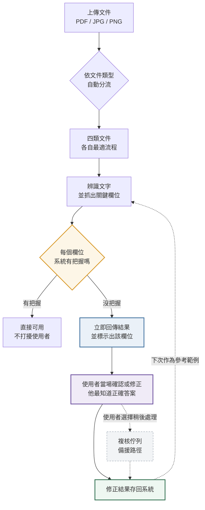
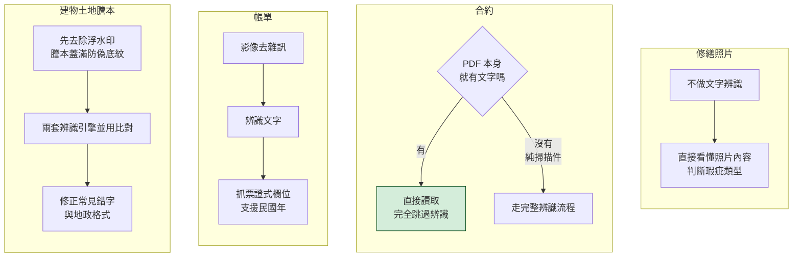
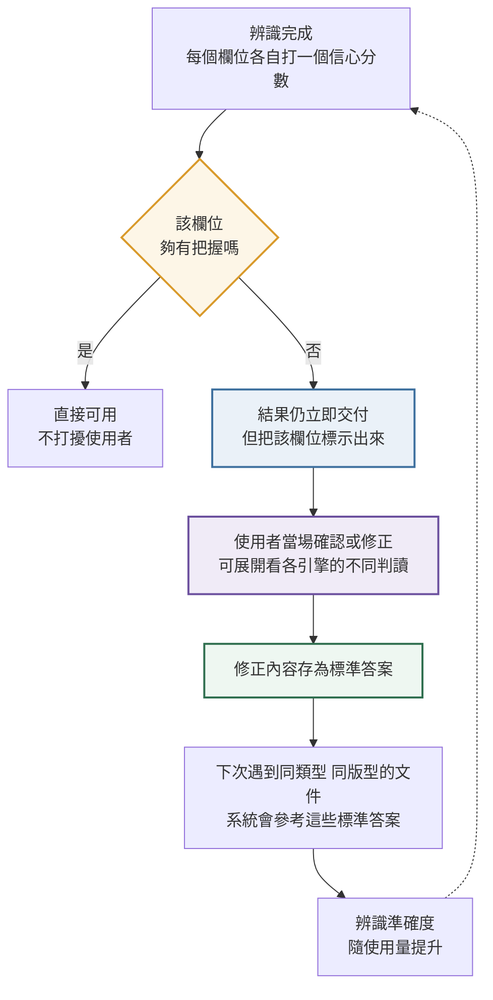

# DocuMind 圖片文字辨識流程說明（行銷版）

> **對象**：行銷、業務、提案人員
> **用途**：對外說明產品怎麼運作、跟一般 OCR 差在哪
> **最後更新**：2026-08-05

本文不含技術細節，可直接取用於簡報與提案。文中所有效益數字皆標示為「預估」，使用規範見文末〈對外說明的注意事項〉，提案前請務必先看。

---

## 一句話總結

**使用者上傳文件 → 系統依文件類型用最適合的方式辨識 → 沒把握的地方主動交給人確認 → 人的修正回存系統，下次更準。**

關鍵差異不是「辨識得多準」，而是**系統知道自己什麼時候不準，並且會說出來**。

---

## 支援的文件與產出

| 文件類型 | 系統自動抓出的欄位 | 適用場景 |
|---|---|---|
| **建物土地謄本** | 地號、建號、面積、權利範圍、所有權人 | 不動產估價、產權查核 |
| **帳單** | 金額、日期、戶號 | 水電費、管理費核銷 |
| **合約** | 合約編號、簽訂／生效日期、甲方、乙方、金額、幣別 | 合約管理、租賃建檔 |
| **修繕照片** | 瑕疵標籤（漏水、壁癌、龜裂、設備損壞）、狀況描述 | 物件修繕評估、保險理賠 |

**上傳規格**：PDF、JPG、PNG，單檔 20 MB 以內。多頁 PDF 會逐頁處理。修繕照片僅接受影像，不接受 PDF。

### 另外兩項可以講的能力

| 能力 | 說明 |
|---|---|
| **文件內容問答** | 上傳時可一併提問（例如「合約金額是多少？」），系統依辨識結果回答，不必自己翻文件找 |
| **文件類型自動建議** | 系統會判讀並建議文件類型，減少選錯的機會；最終仍以使用者指定為準 |

---

## 流程圖一：整體流程

---

## 流程圖二：四類文件各走各的路

一般 OCR 產品是「一套流程通吃所有文件」。DocuMind 針對每一類文件用不同做法，因為它們的難點完全不同。

**三個可以對外講的設計亮點：**

1. **謄本先去浮水印** — 謄本印滿防偽底紋，直接丟給一般 OCR 會把底紋讀成亂碼。
2. **謄本與帳單並用兩套辨識引擎** — 互相比對可降低單一引擎誤判的風險。
2. **合約會先看有沒有現成文字** — 電子簽章或數位產製的合約 PDF 本身就帶文字，系統直接讀取、跳過辨識，**又快又不花辨識成本**。只有掃描件才走完整流程。
3. **修繕照片不走文字辨識** — 照片上本來就沒字，走的是「看懂影像內容」，直接判斷是漏水還是壁癌。

---

## 流程圖三：越用越準的機制

這是本產品最核心、也最好講的部分。

### 三個對外賣點

**一、寧可承認不確定，也不硬猜。**
系統對每個欄位分別評分，只要有**任何一個**欄位沒把握，整份就排入人工複核。採最保守的判斷方式——不會因為其他欄位都很準，就讓有問題的欄位混過去。
**但這不會拖慢使用者**：結果一律立即回傳，複核在背景進行。

**二、人的修正不會白費。**
每一次人工修正都被存成標準答案。下次遇到同類型、同版型的文件，系統會拿這些答案當參考。**使用者用得越多，系統越準，而且不需要重新訓練模型、不需要額外費用。**

**三、使用者就是最佳確認者。**
低信心欄位由**使用者當場確認**，不必養一組後台審查團隊。使用者是文件當事人、最知道正確答案。系統也不會拿自己的辨識結果來教自己——只有真人確認過的修正才會進入學習池。

---

## 交叉比對：揪出「看起來合理但其實錯了」

這是本產品與通用 AI 最根本的差別，值得單獨講。

傳統 OCR 讀錯會產生亂碼，肉眼一看就知道有問題。**生成式 AI 讀錯則會產生語法通順、格式正確、但數字是錯的內容**——拼字檢查抓不到，人也看不出來。這種錯誤一旦流入估價或合約建檔，代價很高。

DocuMind 的作法是**讓兩套獨立的辨識引擎各自讀同一份文件，再逐個欄位比對**：

| 情況 | 系統的處理 |
|---|---|
| 兩套引擎讀出**同一個**答案 | 該欄位維持高信心，直接可用 |
| 兩套引擎讀出**不同**答案 | 該欄位信心度被壓低並標示出來，使用者可展開看兩邊分別讀到什麼，當場判斷 |

關鍵在於：這個訊號**不依賴 AI 自己說它有多確定**。模型對自己的判斷過度自信是常見問題，而「兩套引擎是否得出一致結果」是外部、可驗證的證據。比對時會先做格式正規化，例如 `153.00` 與 `153`、民國與西元紀年會視為相同，避免把格式差異誤報為不一致。

---

## 效益與規格數字

> **下表數字目前皆為預估值。** 準確率基準測試需要先由專業人員完成標註資料集，目前正在進行中。實測數據產出後將更新本表。

| 項目 | 數字 | 狀態 | 依據 |
|---|---|---|---|
| 關鍵欄位準確率 （地號、建號、面積、金額） | **95%** | `預估` | 產品設定目標，基準測試尚未執行 |
| 整體辨識準確率 | **85%** | `預估` | 產品設定目標，基準測試尚未執行 |
| 單頁處理時間 | **30 秒內** | `預估` | 設計目標，不含選用的 AI 加強校正；效能驗收尚未執行 |
| 月營運成本 | **$15 以下** | `預估` | 成本試算，實際依用量與部署方式而定 |
| 單檔上限 | **20 MB** | `已確認` | 系統實際限制 |
| 支援格式 | **PDF / JPG / PNG** | `已確認` | 系統實際支援 |
| 「越用越準」的提升幅度 | **未量測** | `預估` | 回饋機制已實作並可運作，但提升幅度尚無實測數據 |

---

## 常見問題

**Q：跟直接用 ChatGPT 讀文件差在哪？**
兩點。第一，通用 AI 讀錯的時候，會產生**看起來很合理但數字是錯的**結果，一般人看不出來；DocuMind 用多重檢查揪出這種狀況並主動示警。第二，資料可以完全留在客戶自己的機器，不外送到第三方。

**Q：資料會外流嗎？**
架構上可設定為**完全本地運行**，文件內容不傳送到任何外部服務。辨識引擎本身就在本機執行，AI 校正層也可切換為本地模型。對個資敏感的客戶（不動產、金融）這是硬需求。
※ 兩點要注意：一、**修繕照片走的是影像理解，全本地運行需要另外部署本地視覺模型**，不是把雲端關掉就會動。
二、正式的全本地運行驗收測試尚未完成，若客戶要寫進合約，請先找工程團隊確認。

**Q：辨識要多久？**
設計目標為單頁 30 秒內完成（不含選用的 AI 加強校正階段），實測數據待效能驗收後提供。對外請描述為「數十秒級」，不要給保證秒數。

**Q：一定要人工複核嗎？會不會拖慢流程？**
**不需要專門的複核人力。** 設計上由使用者當場確認低信心欄位——他是文件當事人，最知道正確答案。結果一律立即回傳，高信心欄位完全不需要操作。若使用者當下不想處理，可留待複核佇列稍後處理，那是備援而非主要路徑。門檻可依客戶需求調整——要求高就調嚴一點（更多進複核），求快就調鬆。

**Q：支援簡體中文或英文嗎？**
目前主力是**繁體中文**，並針對台灣地政用語、民國紀年、地號格式做過最佳化。其他語言需另行評估。

---

## 對外說明的注意事項 ⚠️

**所有效益數字目前均為預估值，尚未完成實測驗證。對外引用時必須加註「預估」二字，不可呈現為已驗證數據。**

| ✅ 可以這樣講 | ❌ 不可以這樣講 |
|---|---|
| 系統會針對每個欄位評估把握程度，沒把握的主動交由人工確認 | 準確率**達** 95% |
| 人工修正會回饋到系統，使用越久越準確 | 比 ChatGPT 準 X% |
| 支援完全本地部署，資料不外送（修繕照片需另外部署本地視覺模型） | 保證單頁 30 秒完成 |
| 預估關鍵欄位準確率可達 95%（目標值，實測進行中） | 任何未加註「預估」的百分比或秒數 |

---

## 需要更多素材時

| 需求 | 找誰／看哪裡 |
|---|---|
| 實際辨識效果截圖 | 請工程團隊提供 demo 環境操作畫面 |
| 準確率數據 | 待基準測試完成後提供 |
| 部署方式與成本 | `docs/DEPLOYMENT.md` |
| 客製化文件類型可行性 | 請工程團隊評估，架構上支援擴充 |
